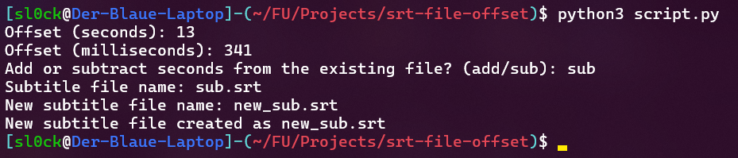

# SRT File Offset

by sl0ck

---

Are the subtitles for your video too early or delayed? This simple script helps to automatically subtract or add `n` seconds and `m` milliseconds from your SRT file.

## Usage

Use this file in the same directory as your SRT file.

```sh
python3 script.py
```

